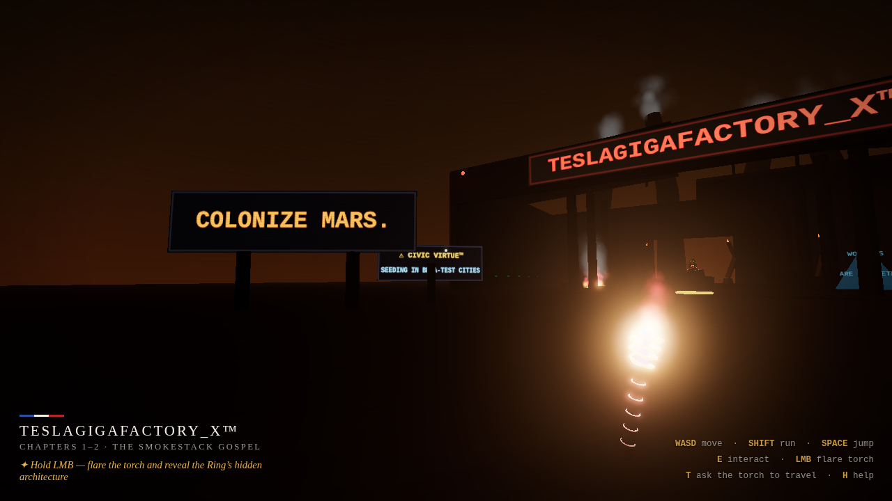
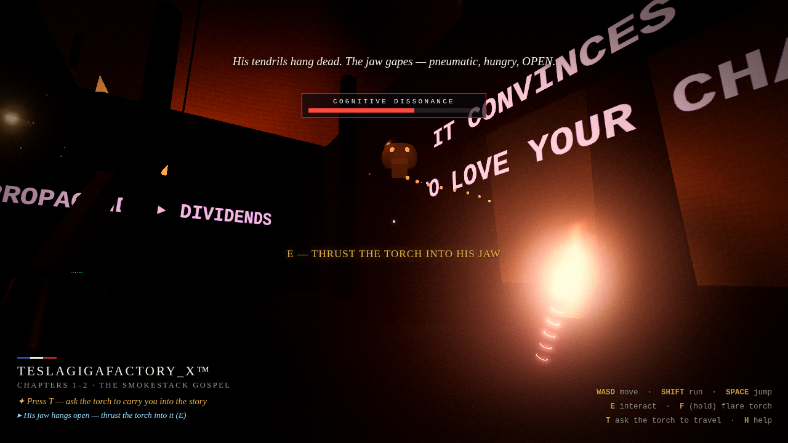
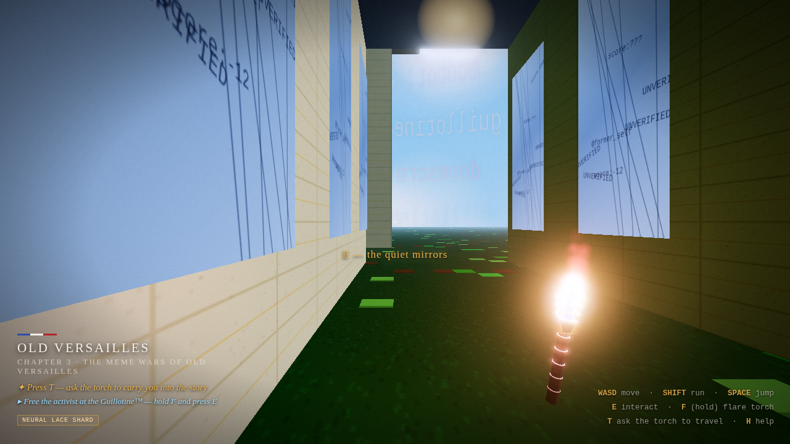
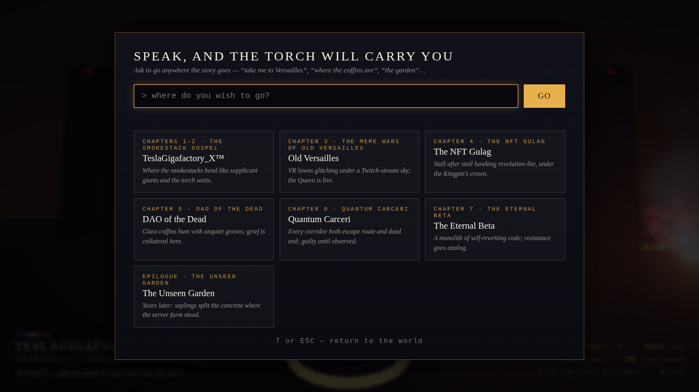
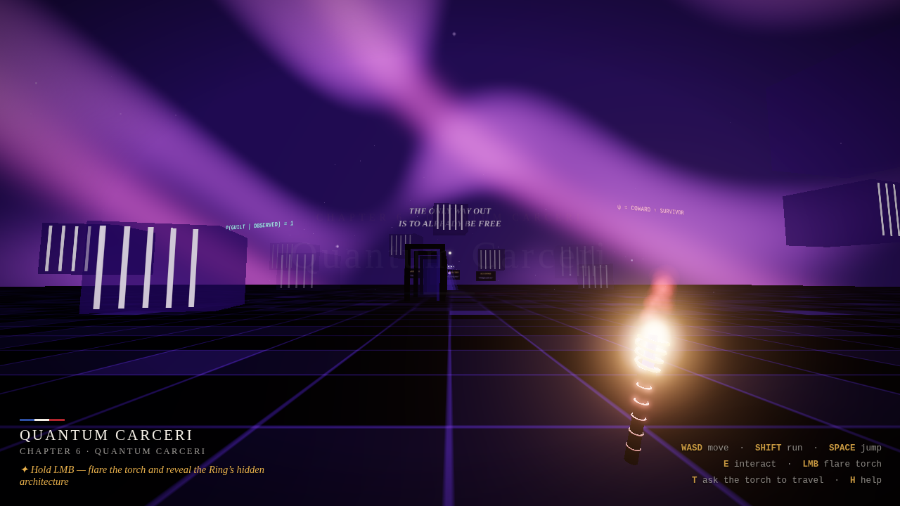
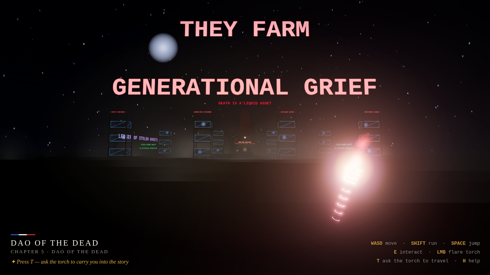
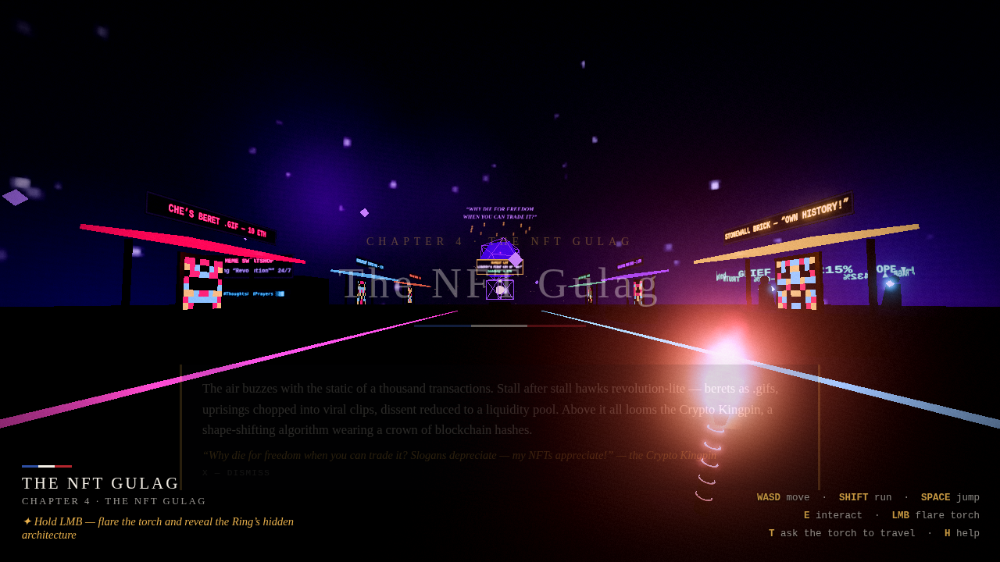
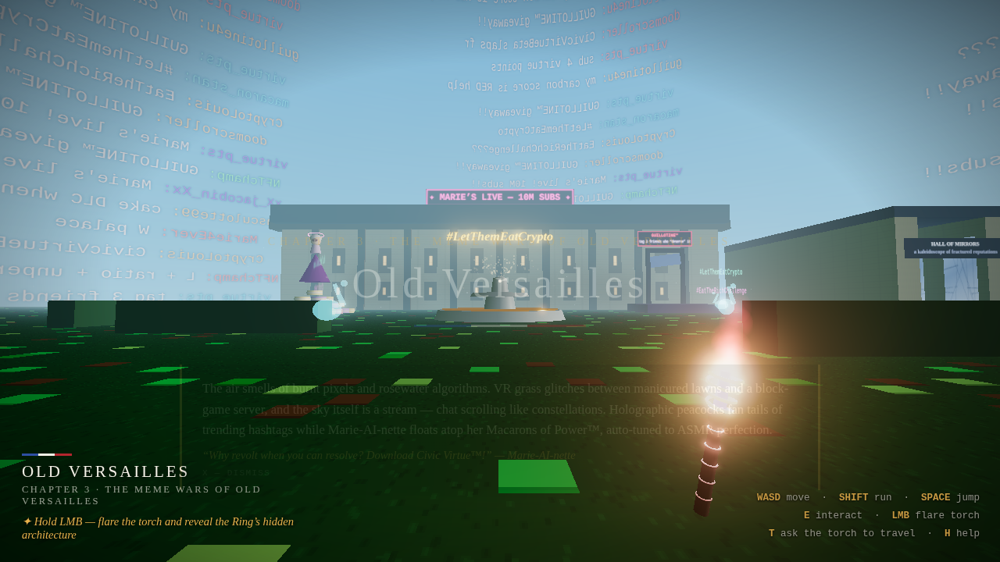
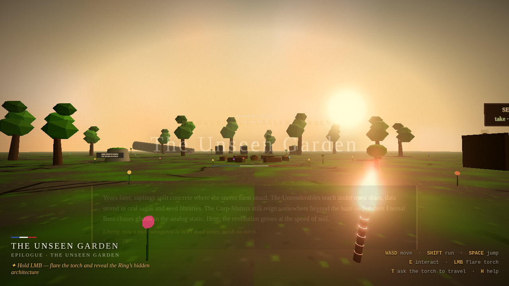

# LIBERTY ASCENDING — The Torchbearer

*A browser-playable 3D game set inside the world of* **Liberty Ascending: A Revolutionary Fable**.

You are dropped barefoot into the burning TeslaGigafactory_X™ — the opening page of the fable —
where Liberty's torch waits on a pedestal: *"a salvaged LED strip jury-rigged to pulse at 1215 nm,
wavelength of awakening."* Take it up, wield it, and ask it to carry you through every chapter of
the story, from the Meme Wars of Old Versailles to the Unseen Garden of the epilogue.



## Play it

**Easiest:** the hosted version on GitHub Pages — no install at all:
**https://martinmontero.github.io/Liberty-Assending/**

**Locally:** any static file server works — there is **no build step**. With
[Node.js](https://nodejs.org) installed (Windows/Mac/Linux):

```bash
git clone https://github.com/MartinMontero/Liberty-Assending && cd Liberty-Assending
node serve.mjs
```

then open `http://localhost:8000` in your browser. (Python users: `python -m http.server 8000`
works too. Everything is relative-path, fully offline, zero CDN calls.)

Click **TAKE UP THE TORCH**, then click the world to grab the pointer.

## How to play

| Input | Action |
| --- | --- |
| `WASD` / arrows | move · `SHIFT` run · `SPACE` jump |
| Mouse | look (pointer lock) |
| `E` | interact — take up the torch, speak to the Fellowship, touch what glimmers |
| `F` (hold) | **flare the torch** — 1215 nm, wavelength of awakening: it severs tendrils, scorches peddlers, cracks coffins, codes counter-memes, and reveals the Ring's hidden writing |
| `T` | **ask the torch to travel** — type free text like *"take me to Versailles"*, *"where the coffins are"*, *"the garden"* — or click a chapter card |
| `X` | dismiss narration · `N` mute ambience · `H` handbook |

On arrival anywhere, a title card and a narration panel describe **what surrounds you**, in the
fable's own words — and a quest line picks up that chapter's struggle.

## Play the fable, don't just walk it

Every chapter is a mission built from the book's own dynamics — and the fable's thesis is the
core mechanic: *"You can't kill an idea with fire. Only with a better idea."* The torch never
deals damage; it **encodes counter-narratives**.

1. **The Smokestack Gospel** — Robespierre's tendrils inject *cognitive dissonance* (watch the
   meter; back off before it floods you). Modulate the torch to counter-narrative frequency —
   hold `F` aimed at him — to **sever all six tendrils**, then thrust the torch into his open
   jaw. From his wreck you pull the **Neural Lace Shard**. Logos, Praxis and Soma camp by the
   road under the One Ring schematic.
2. **The Meme Wars of Old Versailles** — stay out of the peacocks' gaze or your **Virtue
   Score** trends and you get doxxed. Free the activist on the Guillotine™ by coding a
   counter-meme (flare + `E`), then carry the Shard into the Hall of Mirrors and **deploy it
   into the Civic Virtue™ servers**. The palace collapses into a .zip of cringe.
3. **The NFT Gulag** — scorch the three peddlers with unmarketable truth, hold the flare before
   the Crypto Kingpin to **flood his market with infinite crowns** (scarcity dies, the crown
   falls), and burn *Liberty's first cry of "No!"* free of its auction cage.
4. **DAO of the Dead** — deploy the **Copyleft Ouija Board** to give the dead root access, then
   crack five coffin racks with the flare so the souls remember themselves — and last, press
   your palm to Maria Kwan's coffin.
5. **Quantum Carceri** — the Warden stalks you and **Bayesian Guilt** rises in its gaze; max it
   and the what-if singularity spits you backward. Speak the Apology Algorithm *in order* —
   Admit Harm → Reject Absolution → Act Anyway — then face it and hold both truths.
6. **The Eternal Beta** — unplug your neural jack so the FOMO drones lose your scent, scavenge
   the dead tech (floppy · rotary dial · cassette of her mother's voice) to power the
   Frankenstein Server until the Beta stalls at BUFFERING…, then **lob the Memory Grenade**.
7. **The Unseen Garden** — liberate all six chapters and plant the future to earn the true
   ending: *the end, or the long beginning.*

Each liberation is tracked (⚑ n/6), relics live in your inventory chips, and the garden knows
whether the Ring still stands.





## The seven chapters, replicated

| Zone | From the fable |
| --- | --- |
| **TeslaGigafactory_X™** (ch. 1–2) | Bent smokestacks weeping smoke, dead-meme billboards (*BUY STARS. COLONIZE MARS. THE MARKET WILL ADJUST.*), twitching robot arms over Cybertruck husks, server racks with Praxis's crowbar, the flickering "workers are obsolete" hologram, sirens, fires — and Robespierre, the Cerebral Reaper, tracking you with fiber-optic tendrils. |
| **Old Versailles** (ch. 3) | VR lawns glitching into block-game tiles under a Twitch-chat sky, the NFT champagne fountain under #LetThemEatCrypto, holographic peacocks fanning hashtag tails, the Macarons of Power™ pyramid with floating Marie-AI-nette, the Guillotine™ engagement stage, and the Hall of Mirrors of fractured reputations. |
| **The NFT Gulag** (ch. 4) | A neon bazaar of commodified revolt — Che's beret as a .gif, deepfaked protest clips, Liberty's speeches chopped and auctioned — the rarest lot (*Liberty's first cry of "No!"*) in its wireframe cage, the high-frequency trading pit, and the Crypto Kingpin under his orbiting crown of blockchain hashes. |
| **DAO of the Dead** (ch. 5) | A necropolis of glass coffins stacked like server racks, souls flickering inside, PTSD-NFT epitaphs, *DEATH IS A LIQUID ASSET* pulsing in blood-red code, griefbots spray-painting *You Are Not a Stock Photo*, and Maria Kwan's coffin — press your palm to it and set her ghost free. |
| **Quantum Carceri** (ch. 6) | A superposition prison under a probability-storm sky: phasing cell blocks, doors both open and closed, the drifting many-bodied Quantum Warden, and the Apology Algorithm floating in three tablets: *Admit Harm. Reject Absolution. Act Anyway.* |
| **The Eternal Beta** (ch. 7) | The self-rewriting code Monolith with its never-finishing progress bar, FOMO drones raining fake victories, billboards sneering *YOUR OUTRAGE IS SO LAST UPDATE*, and the analog resistance: the Library of Dead Tech, the Frankenstein Server on pirate radio, and the Memory Grenade. |
| **The Unseen Garden** (epilogue) | Years later. Saplings split the server-farm concrete, seed libraries replace databases, the plinth stands empty (*she needed no torch*) — and at the story circle you can plant the future yourself. |







## The torch is the mechanic

- It **pulses at 1215 nm** — idle, it breathes; held, it lights the world around you.
- **Flaring it** (hold F) doesn't just burn brighter: it exposes the Ring's hidden
  architecture — debt-contract glyphs, guilt equations, ledger chains — different writing in
  every chapter, invisible until lit.
- It is also your **navigator**: press `T` and speak a destination in plain words. A keyword
  matcher maps phrases like "the quantum prison", "back to the burning factory", or "where the
  coffins are" onto chapters.
- A light objective chain follows the fable's arc: find the torch → wield it → travel the
  story → walk all seven chapters → plant the future. Finish it and you get the fable's last
  line: *"The revolution is growing at the speed of soil."*

## Tech

- **three.js r184**, vendored into `vendor/` — no CDN, no bundler, no build. Pure ES modules
  with an import map.
- Everything is procedural: all geometry is primitives, every texture is generated on a
  `<canvas>` at boot (billboards, glitch-grass, code-rain, star fields, NFT "art"…), audio is
  synthesized WebAudio ambience per zone. The repo contains **zero binary game assets**.
- Custom pointer-lock FPS controller (WASD/run/jump, AABB collision, walkable tops), CPU
  particle system on `THREE.Points` (fires, smoke, souls, fireflies, champagne), per-zone fog +
  sky domes + animated shader sky (the probability storm), UnrealBloom post-processing.
- Seven zones live in one scene, 2 km apart; only the active one is visible/updated.

```
index.html          UI shell, HUD, import map
src/main.js         boot, render loop, objectives, input
src/player.js       FPS controller + collision
src/torch.js        the torch: prop, view-model, flare, lights
src/travel.js       free-text "ask to go" parser + teleports
src/world.js        zone framework + shared builders
src/zones/*.js      the seven chapters
src/textures.js     canvas texture factory
src/particles.js    CPU particle system
src/audio.js        procedural WebAudio ambience/sfx
test/e2e.mjs        full Playwright playthrough (the game tests itself)
```

## Testing

A real end-to-end playthrough runs in headless Chromium — it walks to the torch, picks it up,
flares it, asks for every chapter by free-text phrase, hops the garden benches, plants the
future, and asserts the finale, screenshotting along the way:

```bash
npm install
npx playwright install chromium   # once
npm test
```

Expected output ends with `ALL CHECKS PASSED ✦`.

---

*"You can't kill an idea with fire. Only with a better idea." — Liberty*
